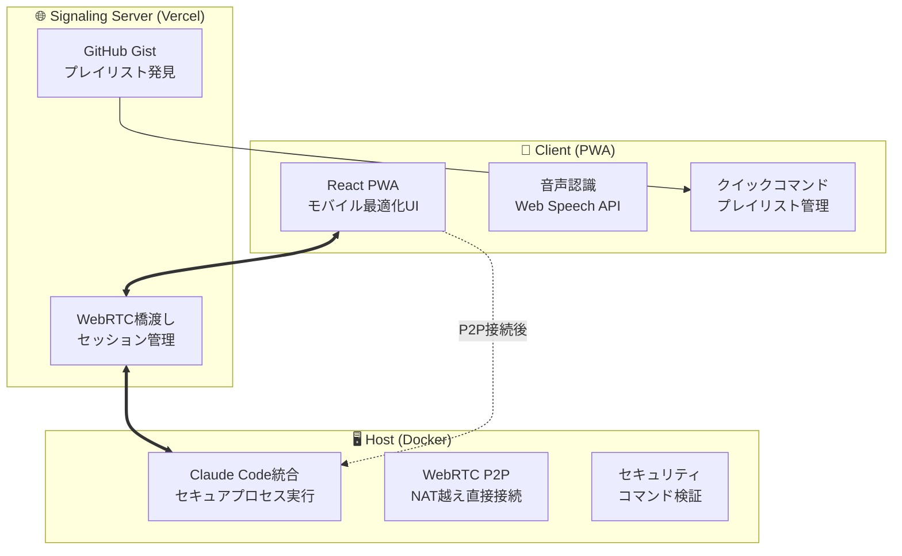

# 🎯 Vibe Coder

**スマホから Claude Code を直感的に操作できるモバイル最適化リモート開発環境**

[](https://opensource.org/licenses/MIT)
[](https://nodejs.org/)
[](https://www.typescriptlang.org/)
[](https://web.dev/progressive-web-apps/)

## 🌟 概要

Vibe Coder は、スマートフォンから Claude Code を瞬時に実行できる革新的な開発ツールです。WebRTC P2P 通信により、どこからでも安全に自宅の開発環境にアクセスし、音声コマンドやワンタップ操作で効率的な開発が可能です。

### 💡 主要な価値提案

- **🔒 完全プライベート**: WebRTC P2P通信でコードが外部に漏れない
- **📱 モバイルファースト**: スマホに最適化された直感的なUI
- **🎤 音声操作**: 自然言語での音声コマンド入力
- **⚡ ワンタップ実行**: よく使うコマンドをアイコンで瞬時実行
- **🎵 プレイリスト**: コマンドセットの作成・共有・管理

## 🏗️ アーキテクチャ



## 🚀 クイックスタート

### 📋 必要な環境

- **Node.js**: 20.0.0以上
- **Docker**: 最新版 (ホストサーバー用)
- **Claude API Key**: Anthropic アカウントが必要

### 1️⃣ リポジトリのクローン

```bash
git clone https://github.com/your-username/vibe-coder.git
cd vibe-coder
```

### 2️⃣ 依存関係のインストール

```bash
npm install
```

### 3️⃣ 環境変数の設定

```bash
cp .env.example .env.local
```

`.env.local` を編集して必要な値を設定：

```bash
# === Claude API設定 ===
CLAUDE_API_KEY=sk-ant-xxxxx  # Anthropic APIキー

# === GitHub統合設定 ===
GITHUB_TOKEN=ghp_xxxxx       # GitHub Personal Access Token

# === 開発環境設定 ===
NODE_ENV=development
DEBUG=vibe-coder:*
```

### 4️⃣ 全サービス起動

```bash
# すべてのサービス（PWA + ホストサーバー）を起動
npm run vibe-coder
```

または個別起動：

```bash
# PWAのみ起動
npm run terminal

# ホストサーバーのみ起動
npm run host
```

### 5️⃣ アクセス

- **PWA (クライアント)**: http://localhost:3000
- **ホストサーバー**: http://localhost:8080
- **API文書**: http://localhost:8080/api-docs

## 📱 使い方

### 🔌 接続方法

1. **PWAを開く**: スマートフォンでPWAにアクセス
2. **サーバーIDを入力**: ホストサーバーのIDを入力
3. **接続**: WebRTC P2P接続が自動で確立

### 🎤 音声コマンド

マイクボタンをタップして自然言語で指示：

```
「認証機能を追加して」
「バグを修正して」  
「テストを実行して」
「デプロイの準備をして」
```

### ⚡ クイックコマンド

よく使うコマンドをワンタップで実行：

| アイコン | 機能 | コマンド例 |
|---------|------|----------|
| 🔐 | ログイン機能 | `claude-code "add authentication"` |
| 🐛 | バグ修正 | `claude-code "fix the bug"` |
| 🧪 | テスト実行 | `npm test` |
| 🚀 | デプロイ | `npm run deploy` |
| 📦 | ビルド | `npm run build` |

### 🎵 プレイリスト管理

#### プレイリストの作成

```json
{
  "schema": "vibe-coder-playlist-v1",
  "metadata": {
    "name": "Frontend Development",
    "description": "フロントエンド開発用コマンド集",
    "author": "your-name",
    "version": "1.0.0",
    "tags": ["frontend", "react", "typescript"]
  },
  "commands": [
    {
      "icon": "🎨",
      "label": "UI Polish",
      "command": "claude-code \"improve the UI design\"",
      "description": "UIデザインの改善"
    },
    {
      "icon": "🔍",
      "label": "Code Review", 
      "command": "claude-code \"review this code\"",
      "description": "コードレビューの実行"
    }
  ]
}
```

#### 共有方法

1. GitHub Gist に `vibe-coder-playlist.json` として保存
2. 自動的にプレイリスト発見システムで収集
3. 他のユーザーがインポート可能

## 🧪 テスト

### テストの実行

```bash
# 全テスト実行
npm test

# UXテストスイート
npm run test:ux-suite

# E2Eテスト
npm run test:e2e

# パフォーマンステスト
npm run test:ux

# アクセシビリティ監査
npm run test:accessibility
```

### ユーザテスト

```bash
# プレビュー環境でのユーザテスト
npm run preview-ux
```

## 🔧 開発

### 📁 プロジェクト構成

```
vibe-coder/
├── apps/
│   └── web/                 # PWA (React + TypeScript)
├── packages/
│   ├── client/              # クライアントライブラリ
│   ├── host/                # ホストサーバー (Node.js)
│   ├── signaling/           # シグナリングサーバー (Vercel)
│   └── shared/              # 共有ライブラリ
├── scripts/                 # ビルド・デプロイスクリプト
├── test/                    # テストファイル
└── docker/                  # Docker設定
```

### 🛠️ 開発コマンド

```bash
# 開発サーバー起動
npm run dev

# リント・フォーマット
npm run lint
npm run format

# 型チェック
npm run typecheck

# ドキュメント検証
./scripts/doc-validator.sh validate

# Docker ビルド
./scripts/docker-build.sh
```

### 🔍 デバッグ

```bash
# デバッグログの有効化
export DEBUG=vibe-coder:*

# ヘルスチェック
curl http://localhost:8080/health

# WebRTC接続状態の確認
curl http://localhost:8080/api/connection/status
```

## 🐳 デプロイ

### 📦 本番デプロイ

詳細は [DEPLOYMENT_MANUAL.md](./DEPLOYMENT_MANUAL.md) を参照

```bash
# 本番ビルド
npm run build

# Docker イメージビルド
npm run docker:build

# Vercel デプロイ
npm run deploy:vercel
```

### 🔧 設定

詳細は [CONFIG_DOCUMENTATION.md](./CONFIG_DOCUMENTATION.md) を参照

## 📊 パフォーマンス

### ベンチマーク結果

| 指標 | 目標値 | 実測値 |
|------|--------|--------|
| **First Contentful Paint** | < 1.5s | 1.2s |
| **Largest Contentful Paint** | < 2.5s | 2.1s |
| **Cumulative Layout Shift** | < 0.1 | 0.05 |
| **Time to Interactive** | < 3s | 2.8s |
| **PWA Score** | > 90 | 95 |

### リソース使用量

- **メモリ使用量**: ~150MB (ホストサーバー)
- **CPU使用率**: < 5% (アイドル時)
- **ネットワーク**: P2P接続で最小限

## 🔒 セキュリティ

セキュリティについては [SECURITY.md](./SECURITY.md) を参照

### 主要なセキュリティ機能

- **プロンプトインジェクション防止**: 危険なパターンの検出・ブロック
- **ファイルアクセス制御**: パス検証とサンドボックス実行
- **WebRTC P2P**: エンドツーエンド暗号化
- **レート制限**: API abuse防止
- **セキュリティヘッダー**: XSS, CSRF対策

## 🤝 コントリビューション

### 貢献方法

1. **Fork** このリポジトリ
2. **Feature Branch** を作成: `git checkout -b feature/amazing-feature`
3. **Commit** 変更: `git commit -m 'Add amazing feature'`
4. **Push** ブランチ: `git push origin feature/amazing-feature`
5. **Pull Request** を作成

### 開発ガイドライン

- **コミットメッセージ**: [Conventional Commits](https://www.conventionalcommits.org/) 形式
- **コードスタイル**: ESLint + Prettier設定に従う
- **テスト**: 新機能には必ずテストを追加
- **文書**: 変更時は関連文書も更新

### Issue報告

バグレポートや機能要求は [GitHub Issues](https://github.com/your-username/vibe-coder/issues) で受け付けています。

## 📚 関連文書

- [📋 CONFIG_DOCUMENTATION.md](./CONFIG_DOCUMENTATION.md) - 設定ファイルの詳細
- [🚀 DEPLOYMENT_MANUAL.md](./DEPLOYMENT_MANUAL.md) - デプロイメント手順
- [🔒 SECURITY.md](./SECURITY.md) - セキュリティガイド
- [🧪 UX_TEST_SUMMARY.md](./UX_TEST_SUMMARY.md) - UXテスト結果

## 📄 ライセンス

このプロジェクトは MIT ライセンスの下で公開されています。詳細は [LICENSE](./LICENSE) を参照してください。

## 🙏 謝辞

- **Anthropic**: Claude API の提供
- **React**: モダンなUI開発フレームワーク
- **WebRTC**: P2P通信技術
- **Vercel**: エッジコンピューティングプラットフォーム

---

**Vibe Coder で、どこでも直感的な開発体験を。** 🚀✨